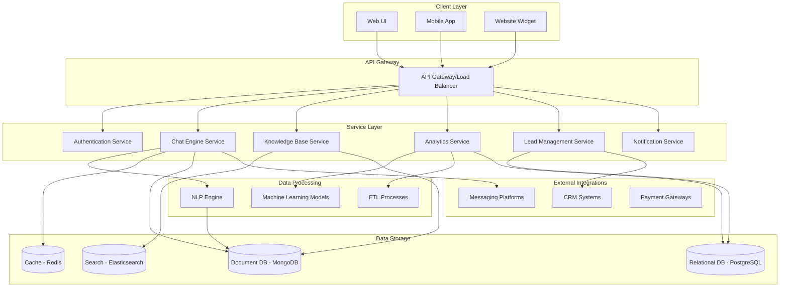

# Project's Architecture Diagram

## Notes

### Knowledge Base Management System
- A structured database to store FAQs, documentation, product info, and policies.
- The content editing interface should be WYSIWYG for non-technical users to add/edit content. 
- Version control, to track changes and roll back when needed.

### The Chatbots
- Essentially the same as rasa, ManyChat, etc (A drag-and-drop interface for creating convo paths).
- Built with rasa API.

### Lead Automation & Conversion
- Data should be gathered naturally in conversations. Leads could be grouped by interests, needs, stage in funnel, etc.
- The product then should be integrated with CRMs.
